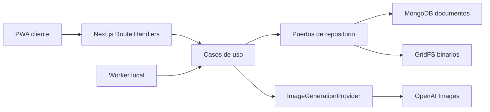

# Especificacion tecnica del MVP de Hair Style Look

> Estado: especificacion ejecutable v2  
> Fecha: 30 de agosto de 2026  
> Alcance: demostracion local verificable, no sistema listo para produccion

## 1. Resultado que se quiere validar

El MVP debe demostrar, con una peluqueria y datos sinteticos o expresamente autorizados, que un cliente adulto puede pasar de un QR a una simulacion de peinado y una ficha de servicio sin escribir prompts ni crear una cuenta.

El criterio principal no es disponibilidad empresarial. Es completar este recorrido:

```text
QR del salon
  -> sesion anonima en cookie
  -> consentimiento obligatorio
  -> tres respuestas minimas
  -> fotografia
  -> OpenAI Images
  -> resultados persistidos
  -> descarga o eliminacion
  -> ficha basica
```

## 2. Alcance funcional

### Incluido

- QR con `salonSlug`, sin token secreto.
- Intercambio de sesion por cookie persistente `HttpOnly`, `SameSite=Lax` y `Secure` cuando exista HTTPS.
- Consentimiento versionado y bloqueante.
- Cliente sin cuenta y salon unico inicialmente.
- Tres campos obligatorios:
  1. `style`: un `hairstyleId` curado o `customStyleText`.
  2. `currentLength`: `very_short`, `short`, `medium` o `long`.
  3. `changeLevel`: `subtle`, `medium` o `radical`.
- El estilo libre se normaliza y guarda en `style_suggestions` como `pending`; nunca entra directamente en el prompt del proveedor.
- Captura o carga de una foto frontal con validacion de MIME, tamano y dimensiones.
- Generacion asincrona mediante OpenAI Images, con un adaptador reemplazable.
- Maximo dos jobs ejecutandose a la vez por sesion.
- Reintento solo por accion del usuario.
- Advertencia discreta al llegar a cinco solicitudes equivalentes para la misma foto y sesion.
- Resultados parciales y mensajes estaticos de error.
- Persistencia MongoDB de sesiones, catalogo, jobs, resultados y ficha.
- Persistencia de binarios en GridFS.
- Descarga al dispositivo y eliminacion solicitada por el cliente.
- Recuperacion tras reiniciar el navegador mientras la cookie y la sesion sigan vigentes.
- Limite duro de gasto de OpenAI de USD 10 por entorno.

### No incluido

- despliegue de produccion o alta disponibilidad;
- pagos al usuario, reservas completas, CRM, caja o facturacion;
- personalizacion multi-local o roles empresariales;
- WhatsApp, correo o uso de datos de contacto;
- segundo proveedor real o fallback automatico;
- Sentry/PostHog obligatorios;
- apps nativas, video, AR, 3D o multiples angulos;
- diagnostico, reconocimiento facial, embeddings biométricos o menores;
- entrenamiento propio, RAG o microservicios.

El presupuesto de USD 10 es un control de costes del proveedor, no una integracion de pagos.

## 3. Stack concreto

| Capa | Eleccion del MVP | Motivo |
|---|---|---|
| Runtime | Node.js 24.19.0 | Version fijada en `.nvmrc` |
| Paquetes | pnpm 11.22.0 | Instalaciones reproducibles |
| Aplicacion | Next.js App Router + React + TypeScript strict | PWA, UI y BFF en un solo proceso |
| Estilos | Tailwind CSS | Ya existe en el scaffold |
| Validacion | Zod | Fronteras HTTP y entorno |
| Persistencia | MongoDB Community local | NoSQL preferido y persistencia tras reinicio |
| Acceso a datos | Driver oficial `mongodb` | Menos abstraccion y soporte de GridFS |
| Binarios | GridFS | Fotos/resultados dentro de MongoDB sin base64 |
| Worker | Proceso Node del mismo repositorio | Jobs recuperables sin plataforma cloud |
| IA | SDK oficial `openai`, OpenAI Images | Proveedor solicitado por defecto |
| Logs | Pino | JSON local sanitizado |
| Tests | Vitest, Testing Library, MSW, Playwright | Unitarios, contratos e E2E |
| Entorno local | Docker Compose para MongoDB | Inicio y volumen reproducibles |

No se usa Mongoose inicialmente. El driver oficial soporta Community, Enterprise y Atlas; Atlas se evalua solo si el MVP progresa a producto.

## 4. Instalacion reproducible

Dependencias de aplicacion y herramientas de CI son locales al proyecto:

```bash
corepack enable
corepack prepare pnpm@11.22.0 --activate
pnpm install --frozen-lockfile
pnpm add mongodb@<version-fijada> openai@<version-fijada>
pnpm add -D <herramienta>@<version-fijada>
pnpm exec <binario>
```

La primera linea habilita el gestor; no instala librerias del proyecto globalmente. `pnpm add -g` queda reservado a herramientas personales que no aparezcan en scripts ni CI. Docker y Git son requisitos del equipo, no paquetes pnpm.

Antes de cambiar dependencias, el coordinador comprueba compatibilidad con Node 24, fija version exacta, actualiza `pnpm-lock.yaml` y ejecuta la puerta de calidad.

## 5. Arquitectura



Es un monolito modular con dos procesos del mismo repositorio: servidor web y worker. No es un microservicio; comparten dominio, casos de uso, contratos y persistencia.

Direccion de dependencias:

```text
presentacion/API -> aplicacion -> dominio
infraestructura -> implementa puertos
```

### Modulos iniciales

```text
src/
  app/
    api/v1/
    consulta/[salonSlug]/
  modules/
    access/
    consent/
    consultations/
    catalog/
    photos/
    generations/
    service-cards/
  integrations/
    mongodb/
    image-generation/
  jobs/
  shared/
```

Crear carpetas solo cuando tengan codigo real.

## 6. Acceso anonimo

### Flujo

1. El QR abre `/consulta/{salonSlug}`.
2. `POST /api/v1/sessions` valida el salon y crea un token aleatorio de al menos 32 bytes.
3. MongoDB conserva `SHA-256(token + pepper)`; nunca el token plano.
4. La respuesta fija `hsl_session` como cookie `HttpOnly`, `SameSite=Lax`, con `Path=/` y `Max-Age` configurable.
5. Cada endpoint resuelve salon y sesion desde la cookie; no acepta el secreto en query, path o body.
6. Revocar o eliminar la sesion invalida el acceso.

En desarrollo HTTP local, `Secure=false`; en cualquier HTTPS, `Secure=true`. La aplicacion nunca envia la cookie a logs, analitica o mensajes de error.

## 7. Consentimiento

La sesion nace en `awaiting_consent`. Solo son accesibles el texto de consentimiento, aceptar, rechazar y health check.

`POST /api/v1/consents` recibe:

```ts
type ConsentDecision = {
  policyVersion: string;
  accepted: boolean;
};
```

Si `accepted=false`, la sesion queda `consent_rejected` y los endpoints de catalogo, cuestionario, foto y generacion responden `403 CONSENT_REQUIRED`. Aceptar registra `policyVersion`, `acceptedAt`, `salonId` y `sessionId`.

Retirar consentimiento revoca nuevas operaciones, cancela jobs que aun no llamaron al proveedor y crea una solicitud de eliminacion para assets locales. La retencion que aplique el proveedor externo se comunica en el texto, no se promete control que la API no ofrece.

## 8. Cuestionario y catalogo

El formulario v1 tiene exactamente tres requisitos. `style` es una union exclusiva:

```ts
type StyleChoice =
  | { kind: "catalog"; hairstyleId: string }
  | { kind: "custom"; customStyleText: string };
```

`customStyleText`:

- 3 a 120 caracteres;
- Unicode normalizado y espacios compactados;
- sin URLs, instrucciones de sistema ni solicitudes ajenas a peinados humanos;
- se guarda como sugerencia `pending` con contador agregado;
- no aparece en el catalogo hasta aprobacion manual.

El catalogo inicial tiene de 12 a 20 estilos y cada estilo incluye nombre visible, descripcion, estado, servicios asociados y una referencia visual autorizada. Precio y duracion son datos del salon, nunca inventados por IA.

## 9. Modelo MongoDB

### Colecciones

| Coleccion | Campos clave |
|---|---|
| `salons` | `_id`, `slug`, `name`, `currency`, `active` |
| `sessions` | `_id`, `salonId`, `tokenHash`, `status`, `expiresAt`, `createdAt` |
| `consent_records` | `_id`, `salonId`, `sessionId`, `policyVersion`, `accepted`, `createdAt` |
| `hairstyles` | `_id`, `salonId`, `name`, `description`, `active`, `serviceIds` |
| `style_suggestions` | `_id`, `salonId`, `normalizedText`, `status`, `occurrences`, `createdAt` |
| `consultations` | `_id`, `salonId`, `sessionId`, `answers`, `status`, timestamps |
| `generation_jobs` | `_id`, scopes, `idempotencyKey`, `status`, `attempt`, lease, cost |
| `assets` | `_id`, scopes, `bucket`, `gridFsId`, `kind`, `status`, retention |
| `service_cards` | `_id`, scopes, `lookAssetId`, service, duration, price, warning |
| `budget_ledger` | `_id`, `environment`, reserved/spent cents, timestamps |
| `incident_events` | `_id`, scopes opacos, `code`, `expiresAt`, timestamps |

Todos los accesos pertenecientes al negocio filtran `salonId`. Los accesos de cliente filtran tambien `sessionId`. Pruebas de repositorio demuestran que una sesion de salon A no ve salon B.

### Indices minimos

- `salons.slug` unico.
- `sessions.tokenHash` unico y TTL sobre `expiresAt`.
- `style_suggestions` unico por `{salonId, normalizedText}`.
- `generation_jobs` unico por `{salonId, sessionId, idempotencyKey}`.
- `generation_jobs` por `{status, leaseExpiresAt}`.
- `incident_events.expiresAt` TTL.
- `assets` por `{salonId, sessionId, status}`.

### GridFS

Buckets separados:

- `input_assets`: fotografia preparada.
- `result_assets`: resultados de OpenAI.
- `moderation_assets`: solo resultados del proveedor ocultados por seguridad.

GridFS divide archivo y metadatos en documentos distintos y no admite transacciones multidocumento. El flujo es:

1. crear `assets.status=uploading`;
2. subir a GridFS con metadata minima;
3. confirmar `gridFsId` y `status=ready` mediante condicion sobre estado previo;
4. un reconciliador elimina uploads incompletos y binarios huerfanos.

La aplicacion transmite el binario desde un endpoint autorizado. No guarda URLs firmadas ni base64.

## 10. Jobs y reintentos

### Estados

```text
queued -> running -> succeeded
                  -> partially_succeeded
                  -> failed
queued/running -> cancelled
```

El worker reclama un job con `findOneAndUpdate` condicional y fija `leaseExpiresAt`. Un worker nuevo puede recuperar un job `running` con lease vencido si no existe un resultado final.

### Idempotencia

- Repetir la misma llamada con el mismo `Idempotency-Key` devuelve el job existente.
- El usuario puede pulsar “Intentar de nuevo”; eso crea una nueva clave y aumenta `attempt` si los guardrails pasan.
- `requestFingerprint` agrupa `sessionId + inputAssetId + styleProfile` para contar equivalentes.
- Al quinto equivalente se guarda `REPEATED_REQUESTS` y se muestra: “Notamos varios intentos iguales. Puedes continuar, pero revisa la foto o el estilo si el resultado no cambia.”
- El contador no bloquea por si solo.

### Limites

- concurrencia: maximo 2 jobs `running` por sesion;
- timeout del proveedor configurable, inicialmente 120 segundos;
- sin reintento automatico de llamada pagada;
- cancelacion cooperativa con `AbortSignal` cuando aun sea posible;
- fallo parcial conserva los resultados validos.

## 11. Proveedor OpenAI Images

Puerto minimo:

```ts
interface ImageGenerationProvider {
  generate(input: GenerateHairstyleInput): Promise<GenerationResult>;
}
```

Reglas del adaptador:

- vive solo en `src/integrations/image-generation/openai/`;
- usa `OPENAI_API_KEY` solo en servidor/worker;
- el modelo se configura con `OPENAI_IMAGE_MODEL` y se valida al iniciar;
- versiona un `generationProfileVersion`;
- prepara un prompt interno controlado a partir de catalogo y respuestas validadas;
- registra modelo, perfil, duracion, intento, tokens/coste disponibles y codigo de error sanitizado;
- no expone prompt, base64, respuesta cruda o clave;
- implementa timeout y traduccion de errores;
- pasa una suite contractual con transporte simulado.

`IMAGE_PROVIDER=openai` es el default normal. El fake determinista solo se habilita explicitamente en unit tests, CI u operacion offline sin presentar el resultado como IA real.

No hay segundo proveedor ni fallback automatico. Ante indisponibilidad: “No pudimos generar tu simulacion ahora. Tu foto y tus elecciones siguen guardadas; puedes intentarlo de nuevo.”

## 12. Guardrails, presupuesto y mensajes

Antes de encolar:

1. consentimiento vigente;
2. foto lista y de la misma sesion;
3. estilo humano valido;
4. menos de dos jobs concurrentes;
5. presupuesto disponible;
6. idempotencia resuelta.

Presupuesto:

- `MAX_OPENAI_BUDGET_CENTS=1000`;
- una reserva atomica precede a la llamada;
- el coste real reconcilia la reserva;
- si no alcanza, no se llama al proveedor;
- solo el coordinador reinicia o eleva el limite.

Mensajes estaticos versionados:

| Codigo | Mensaje visible |
|---|---|
| `CONSENT_REQUIRED` | “Para continuar debes aceptar el uso indicado de tu foto y datos.” |
| `STYLE_SCOPE_REJECTED` | “Esta herramienta solo crea simulaciones de peinados para personas.” |
| `CONCURRENCY_LIMIT` | “Ya tienes dos simulaciones en proceso. Espera a que termine una.” |
| `BUDGET_LIMIT` | “La demostracion alcanzo su limite de generacion. Solicita ayuda al salon.” |
| `PROVIDER_UNAVAILABLE` | “No pudimos generar tu simulacion ahora. Puedes intentarlo de nuevo.” |
| `INAPPROPRIATE_RESULT` | “Ocultamos este resultado porque no cumple las reglas de la demostracion.” |

El sistema registra un incidente sanitizado y presenta al usuario el mensaje. Para problemas del proveedor, el MVP prepara un reporte local para el operador; no envia correos ni tickets automaticamente.

## 13. Retencion, descarga y eliminacion

Antes de generar, el cliente elige:

- `keep_for_return`: conservar localmente para volver mientras la sesion este vigente;
- `delete_after_download`: permitir descarga y eliminar al confirmar la solicitud.

La primera opcion satisface la recuperacion tras reinicio, pero su duracion maxima definitiva queda marcada como decision legal previa a datos reales. El MVP implementa `DELETE /api/v1/assets/{assetId}` y elimina documento y binario de forma idempotente.

`moderation_assets` tiene un maximo tecnico de 24 horas y nunca es visible al cliente. No se usa como base de entrenamiento ni galeria de “imagenes no propias”. Solo puede contener un resultado generado por el proveedor que deba investigarse; una entrada rechazada no se conserva alli.

OpenAI informa que los datos de API no se usan para entrenar por defecto, pero los logs de abuso pueden retener contenido hasta 30 dias salvo controles aprobados. El texto de consentimiento no debe prometer eliminacion inmediata dentro de sistemas que el MVP no controla.

## 14. API v1 inicial

| Metodo | Ruta | Resultado |
|---|---|---|
| `GET` | `/api/v1/health` | Salud de la aplicacion |
| `POST` | `/api/v1/sessions` | Crea/reanuda cookie por `salonSlug` |
| `POST` | `/api/v1/consents` | Registra aceptar o rechazar |
| `GET` | `/api/v1/catalog` | Catalogo del salon para sesion consentida |
| `POST` | `/api/v1/consultations` | Guarda tres respuestas |
| `POST` | `/api/v1/assets/input` | Guarda foto preparada |
| `POST` | `/api/v1/generation-jobs` | Encola o devuelve job idempotente |
| `GET` | `/api/v1/generation-jobs/{id}` | Estado y resultados parciales |
| `GET` | `/api/v1/assets/{id}` | Stream autorizado para vista/descarga |
| `DELETE` | `/api/v1/assets/{id}` | Eliminacion solicitada |
| `POST` | `/api/v1/service-cards` | Persiste ficha seleccionada |

Envelope de exito:

```json
{ "data": {}, "requestId": "opaque-id" }
```

Envelope de error:

```json
{
  "error": { "code": "STABLE_CODE", "message": "Mensaje seguro" },
  "requestId": "opaque-id"
}
```

## 15. Observabilidad local

Pino registra solo:

- `requestId`, `jobId`, `salonId`, `sessionId` opacos;
- estado, duracion, intento, perfil y codigo de error;
- coste estimado/real en centavos.

Prohibido: cookies, token, foto, base64, ruta GridFS, texto libre completo, prompt interno, headers sensibles o respuesta del proveedor.

No se necesita Sentry o PostHog para validar el recorrido local. Los eventos de embudo pueden almacenarse como contadores MongoDB sanitizados si tienen un consumidor inmediato.

## 16. Pruebas

### Unitarias

- estados e invariantes;
- consentimiento bloqueante;
- normalizacion y alcance de estilo;
- idempotencia, contador de cinco, concurrencia y presupuesto;
- mensajes estaticos.

### Integracion

- repositorios con dos salones;
- indices e inicializacion limpia de MongoDB;
- GridFS upload/read/delete y reconciliacion;
- worker, lease vencido y recuperacion;
- rutas, cookies y no enumeracion;
- contrato OpenAI con MSW o transporte simulado.

### E2E

- rechazo de consentimiento;
- QR a resultado y ficha en viewport movil;
- recarga/reinicio y recuperacion;
- dos jobs permitidos y tercero rechazado;
- cinco reintentos y advertencia;
- descarga y eliminacion;
- resultado parcial y mensajes preparados.

Las pruebas reales de OpenAI son manuales, con autorizacion, dataset sintetico y limite separado; nunca corren en CI.

## 17. Fases

### Fase 0 — baseline verde

- alinear Node/pnpm con las versiones fijadas;
- corregir ESLint/TypeScript y descubrimiento de Vitest;
- verificar `lint`, `typecheck`, tests, build y E2E;
- crear el primer commit.

Puerta: todos los checks locales pasan sin servicios externos.

### Fase 1 — persistencia y acceso

- retirar el camino Supabase tras conservar pruebas conceptuales utiles;
- agregar MongoDB Community y driver oficial;
- crear indices, repositorios, sesion/cookie y consentimiento;
- persistir catalogo y las tres respuestas.

Puerta: reinicio conserva sesion/datos y aislamiento entre dos salones pasa.

### Fase 2 — fotos y GridFS

- captura/carga, preparacion y validacion;
- buckets y repositorio de assets;
- stream autorizado, descarga, eliminacion y reconciliacion.

Puerta: binarios privados sobreviven reinicio y se eliminan de punta a punta.

### Fase 3 — generacion OpenAI

- puerto y adaptador OpenAI;
- worker, jobs, polling, resultados parciales;
- presupuesto USD 10, concurrencia 2, quinta repeticion y kill switches.

Puerta: suite contractual simulada verde y una prueba pagada autorizada como maximo.

### Fase 4 — ficha y demostracion

- seleccion de resultado y ficha persistente;
- vista minima de estilista sin panel empresarial;
- E2E movil completo y guion de demo.

Puerta: recorrido completo con datos sinteticos y recuperacion tras reinicio.

### Fase 5 — decision de piloto real

- revision legal humana;
- texto y duracion de retencion definitivos;
- region/transferencias y contrato de proveedor;
- threat model, runbook y criterio de soporte.

No es parte de la construccion local actual.

## 18. Decisiones pendientes

No bloquean Fase 0, pero deben resolverse antes de datos reales:

1. Duracion maxima de `keep_for_return` y proceso de retiro de consentimiento.
2. Identidad legal de responsable/encargado y texto final de consentimiento.
3. Region futura de MongoDB/OpenAI y transferencias internacionales.
4. Canal humano de soporte al salon/proveedor.
5. Servicios, precios y duraciones reales del salon.

## 19. Definition of Done del MVP local

- El recorrido completo funciona despues de reiniciar web, worker y navegador.
- OpenAI es el provider normal y esta aislado por un puerto.
- MongoDB persiste documentos y GridFS persiste binarios.
- No existen secretos en URL, cliente, logs o Git.
- Consentimiento, presupuesto, concurrencia y alcance bloquean antes del cobro.
- Reintentos son voluntarios, idempotentes y observables.
- El usuario descarga y elimina.
- Los errores son plantillas estaticas.
- Tests relevantes pasan y las omisiones se declaran.
- La documentacion no afirma readiness de produccion.

## 20. Referencias oficiales

- [MongoDB Node.js Driver](https://www.mongodb.com/docs/drivers/node/current/)
- [MongoDB GridFS](https://www.mongodb.com/docs/manual/core/gridfs/)
- [MongoDB TTL indexes](https://www.mongodb.com/docs/manual/core/index-ttl/)
- [OpenAI image generation](https://platform.openai.com/docs/guides/image-generation)
- [OpenAI data controls](https://platform.openai.com/docs/models/default-usage-policies-by-endpoint)
